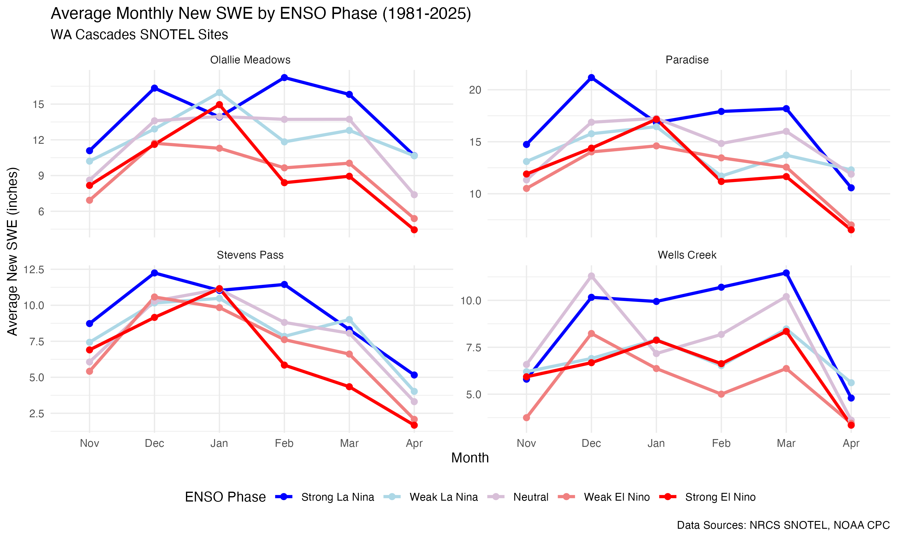
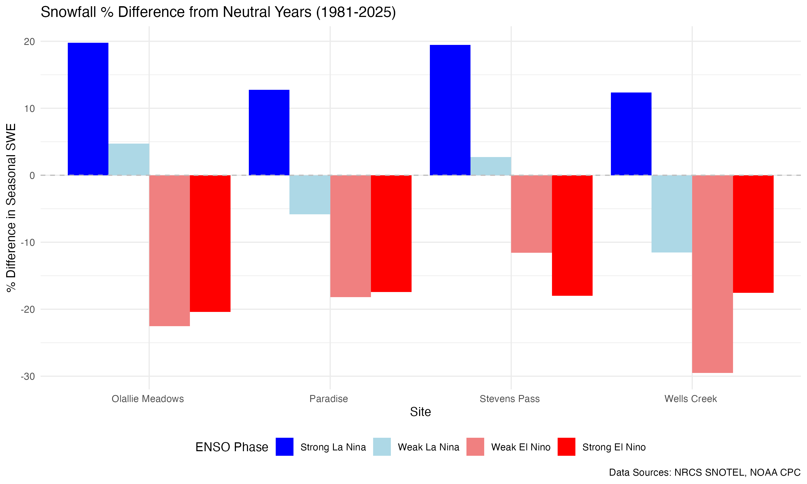

# WA Snowfall & ENSO Analysis

This project analyzes the relationship between El Niño/La Niña (ENSO) climate patterns and snowfall in the Washington Cascades.

## Overview
The analysis uses R to:
1.  Fetch historical ENSO data (Oceanic Niño Index) from NOAA.
2.  Fetch historical daily snowfall (SWE) data from NRCS SNOTEL sites in the WA Cascades.
3.  Classify years into ENSO phases (Strong/Weak El Niño/La Niña, Neutral).
4.  Calculate monthly average snowfall and seasonal percentage differences.
5.  Generate visualizations.

## Sites Analyzed
- **Stevens Pass** (Site ID: 791)
- **Olallie Meadows** (Snoqualmie Pass area, Site ID: 672)
- **Paradise** (Mt. Rainier, Site ID: 679)
- **Wells Creek** (Mt. Baker area, Site ID: 909)

## How to Run
1.  Ensure R is installed.
2.  Run the analysis script:
    ```bash
    Rscript analysis.R
    ```
    The script will automatically install necessary packages (`pacman`, `tidyverse`, `snotelr`, etc.).

## Outputs
### Data ([data/](data/))
- [wa_snow_enso_analysis_data.csv](data/wa_snow_enso_analysis_data.csv): Processed monthly snowfall and ENSO data.
- [enso_classification.csv](data/enso_classification.csv): ENSO phase classification for each year.

### Plots ([plots/](plots/))
- **Monthly Snowfall by ENSO Phase**:
  
  *Shows the average monthly new Snow Water Equivalent (SWE) for each ENSO phase.*

- **Snowfall % Difference from Neutral**:
  
  *Shows the percentage difference in seasonal snowfall compared to neutral years.*

## Key Findings
- **La Niña** years generally show higher snowfall accumulation in the WA Cascades.
- **El Niño** years generally show lower snowfall accumulation.
- The magnitude of the effect varies by site and month.

---

See: [prompt.md](prompt.md) for the prompt used to generate this analysis in 
Antigravity using Gemini 3 Pro. No manual editing was done to the code, other 
than to clean up some of the comments. The README was made by Antigravity from 
the Walkthrough produced by Antigravity. Other than this paragraph, linking to 
some files and fixing an incorrect site ID, no other changes were made to the 
README.
